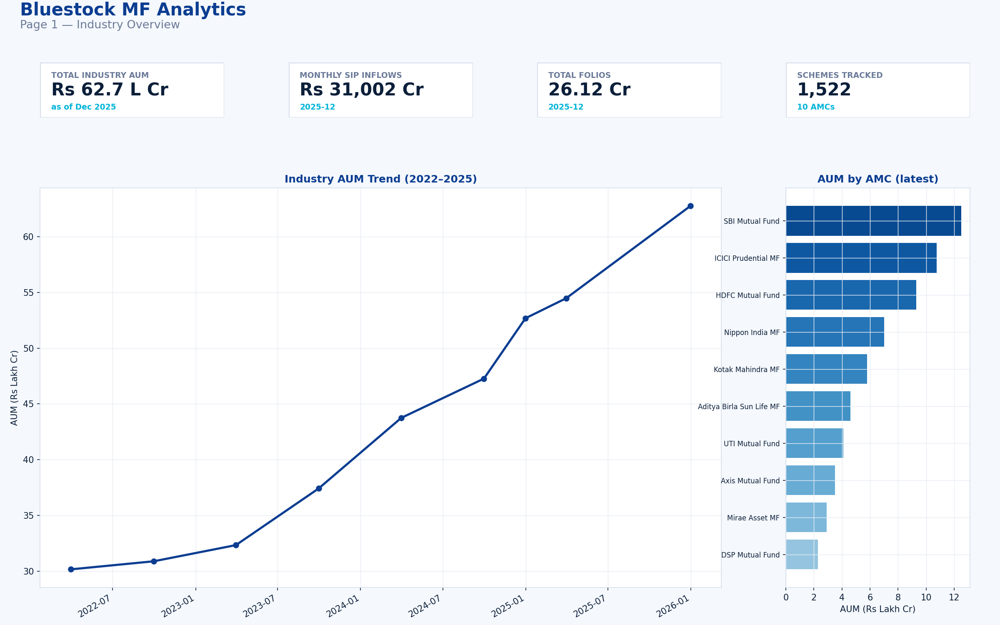
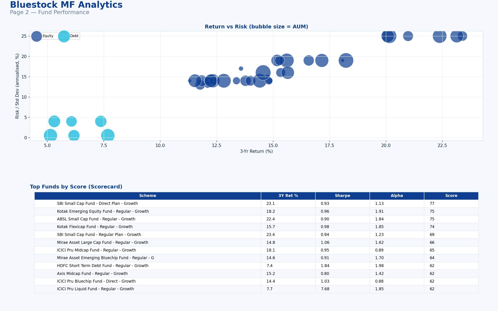
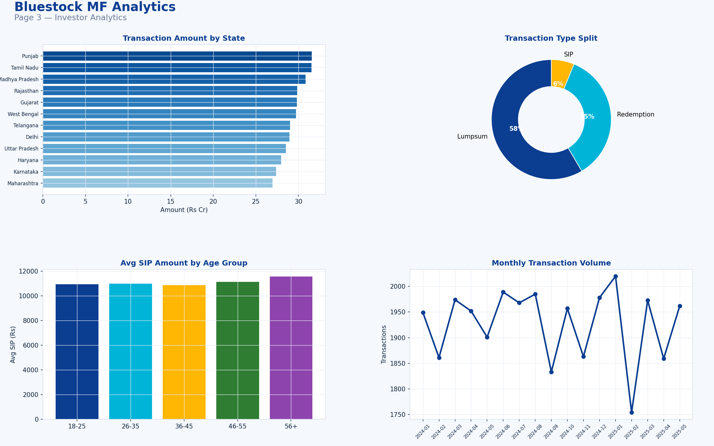
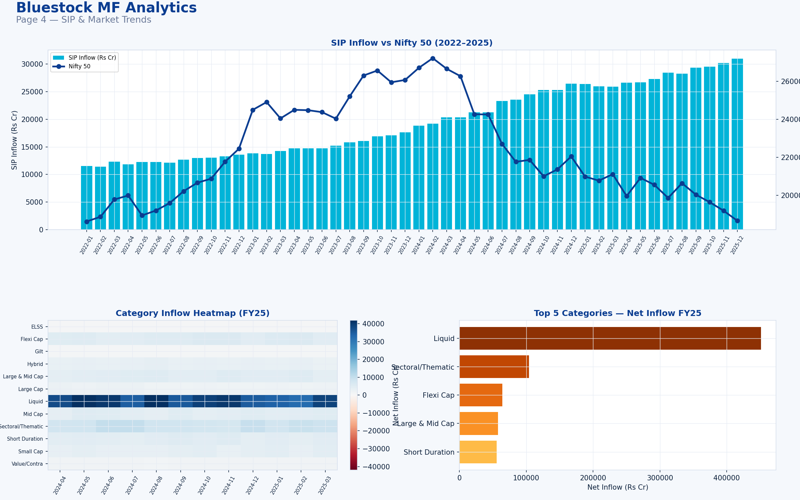

# Mutual Fund Analytics (Capstone Project)

This repository is a complete end-to-end analytics project for mutual funds. It combines data cleaning, exploratory analysis, performance calculations, risk assessment, and an interactive Streamlit dashboard to turn raw mutual fund data into business-friendly insights.

## Tech Stack

        

### Software used in this project
- Python for data processing and automation
- Jupyter Notebook for analysis and visualization
- Pandas and NumPy for data manipulation
- Matplotlib, Seaborn, and Plotly for charts and dashboards
- SQLite for structured data storage
- Streamlit for the interactive dashboard experience
- SQLAlchemy and requests for data handling and integrations

---

## Project Goal
The project aims to answer important questions such as:
- Which mutual funds performed best over different time horizons?
- How do funds compare against benchmarks like Nifty 50 and Nifty 100?
- What is the relationship between risk and return?
- How do SIP inflows and investor behavior vary over time?
- How can the findings be presented in a clean dashboard for business users?

---

## Main Tasks in the Project

### 1. Data Ingestion and Cleaning
This is the foundation of the project. Raw files are collected and prepared into clean datasets for analysis.

What happens here:
- Raw mutual fund and market data are imported
- Missing values, formatting issues, and inconsistent values are cleaned
- Clean files are saved into the processed data folder

Key files:
- data_ingestion.py
- scripts/clean_all_datasets.py
- scripts/clean_nav_history.py

Output examples:
- Data/processed/nav_history_clean.csv
- Data/processed/investor_transactions_clean.csv
- Data/processed/category_inflows_clean.csv

---

### 2. Exploratory Data Analysis (EDA)
This step helps understand the structure, trends, and quality of the data before deeper analysis.

What happens here:
- Distribution of NAVs and AUM values is studied
- Fund categories and investor behaviors are explored
- Trends in inflows and market movement are identified
- Charts are created to uncover business insights

Key notebooks:
- notebooks/EDA_Analysis.ipynb
- notebooks/Performance_Analytics.ipynb

Output examples:
- Charts under reports/eda_png/
- Summary JSON and CSV files in Data/processed/

---

### 3. Performance and Risk Analytics
This step calculates the actual fund performance metrics that investors care about.

What happens here:
- Daily returns and CAGR are computed
- Sharpe ratio, Sortino ratio, and maximum drawdown are assessed
- Alpha and beta are measured against benchmarks
- Funds are ranked and compared with each other

Key notebooks and scripts:
- notebooks/alpha_beta_run.ipynb
- notebooks/day_4_compute_all_daily_returns_cagr_comparison.ipynb
- scripts/compute_max_drawdown.py

Output examples:
- Data/processed/alpha_beta.csv
- Data/processed/daily_returns_all_schemes.csv
- Data/processed/cagr_comparison_1yr_3yr_5yr.csv

---

### 4. Investor and SIP Analytics
This task focuses on investor activity and investment patterns.

What happens here:
- Investor transactions are cleaned and summarized
- SIP and lump-sum behavior are analyzed
- State-wise and monthly transaction patterns are explored
- Insights are built around investor participation and flow trends

Key files:
- notebooks/clean_investor_transactions.ipynb
- notebooks/sip_inflow_monthly_plotly_alltime_high.ipynb

Output examples:
- Data/processed/investor_transactions_clean.csv
- Data/processed/monthly_sip_inflows_clean.csv

---

### 5. Interactive Streamlit Dashboard
The final step turns the analytical work into a presentation-ready dashboard.

What this dashboard does:
- Shows industry-level fund and AUM insights
- Displays fund performance with risk-return comparisons
- Provides investor analytics and SIP trends
- Lets users explore key charts in an interactive way

Dashboard entry point:
- streamlit_app/app.py

Related files:
- streamlit_app/utils/
- streamlit_app/pages/
- streamlit_app/export_report.py

---

## Project Structure
- data_ingestion.py: entry point for data preparation
- live_nav_fetch.py: optional helper for live NAV data
- temp_clean_investor_transactions_run.py: helper for transaction cleaning runs
- notebooks/: analysis and visualization notebooks
- scripts/: reusable Python scripts for cleaning and analytics
- sql/: schema and query templates
- streamlit_app/: interactive dashboard application
- Data/raw/: raw input files
- Data/processed/: cleaned outputs and generated artifacts
- reports/: exported charts and summary outputs

---

## Dataset and Outputs
### Input data
- CSV files in Data/raw/
- Reference PDF in Data/raw/

### Processed outputs
The project generates many outputs under Data/processed/ and reports/ including:
- Cleaned NAV history files
- Investor transaction datasets
- Benchmark comparison files
- Alpha/beta output files
- Risk and performance charts
- Dashboard screenshots and exported visuals

---

## Live Deployment
The Streamlit dashboard is now live at:

https://mutual-fund-analytic.streamlit.app/

## Setup Instructions
1. Install required packages:
   ```bash
   pip install -r requirements.txt
   ```

2. Run the data cleaning scripts if needed:
   ```bash
   python scripts/clean_all_datasets.py
   python scripts/compute_max_drawdown.py
   ```

3. Start the Streamlit dashboard:
   ```bash
   cd streamlit_app
   streamlit run app.py
   ```

---

## Streamlit Dashboard Outputs
Below are sample outputs from the Streamlit dashboard.

### 1. Industry Overview


### 2. Fund Performance


### 3. Investor Analytics


### 4. SIP and Market Trends


---

## Notes
- The processed files in Data/processed/ are the main artifacts used by the notebooks and dashboard.
- The Streamlit dashboard is designed to be a user-friendly alternative to a traditional BI dashboard.
- Results depend on the quality of the raw input data and the selected benchmark windows.
